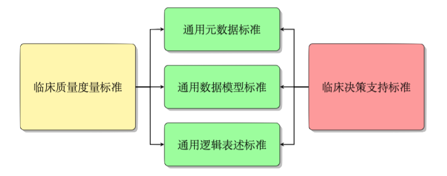

# CDS与eCQM的交集

## CDS和eCQM

临床决策支持(CDS)和电子临床质量度量(eCQM)密切相关，具有许多共同的需求，并都用于支持医疗质量的提高。了解它们之间的差异很重要，先来看看两者正式一点的定义:
* **临床决策支持** 是一种健康信息技术能力，建立在电子健康记录(EHR)的基础之上，可为参与护理过程的人员提供通用的和特定于人员的信息，并在适当的时间对其进行智能筛选和重组，以增强医疗过程。
* **电子临床质量度量**是一种临床质量评估方式，使用来自电子健康记录(EHR)和健康信息系统的数据来评价医疗质量水平，尤其是在病人医疗过程中以结构化形式捕获的数据。可以通过EHR系统进行统计，评估系统提供商或医疗机构的绩效。

> 好了，上面是专业说法。现在用大白话来举个例子吧，不精确，但能让你理解它们的不同。比如，医生正在开处方，突然系统蹦出个提醒，说你这个药开的不好，应该换那个药，这个就是临床决策支持服务在后台发挥的作用。再说说临床质量度量，这是个啥，换个我们容易理解的说法，统计指标，差不多就是这个意思。

最初分别开发CDS和eCQM的标准，使用了不同的数据模型和可计算的规则表述语言，而使用不同的标准:
* 使得eCQM和CDS之间逻辑表述的可重用性和共享变得非常困难
* 给医疗信息化的开发人员和实施人员带来负担

## 为什么要交集

将具有相同关注点的相关度量进行标准化（例如，对医院或疗养院中的患者进行流感疫苗接种）；针对相同目标人群的相关度量（例如，针对糖尿病患者的眼科检查）；或适用于许多度量的定义（例如，为儿童指定的年龄），以使它们一致或保持兼容性。

总之就是，一家人别说两家话！它们俩有太多相同的领域，统一后大家都轻松，还能互通有无，开发起来也方便，不用再转换来转换去。最终决定与其开发可用于eCQM和CDS的新标准，不如将重点放在:
* 重组或模块化现有标准，使其更加灵活
* 制定可由eCQM和CDS共享的通用组件

## 谁在管这事

CQF是HL7下的一个项目组，旨在识别、制定和协调CDS与eCQM的标准，以促进标准的集成和可重用。你可以看看[CQF Wiki](https://confluence.hl7.org/display/CQIWC/Clinical+Quality+Framework)了解更多内容。

下表描述了CDS和eCQM当前使用的标准:

|  | 患者与临床数据 | 逻辑表述 | 元数据结构 | 评估模型 |
| --- | --- | --- | --- | --- |
| CDS | 虚拟病历(vMR)(基于V3) | 临床质量语言 | CDS知识工件实现指南 | [基于V3的决策支持规范](http://www.hl7.org/implement/standards/product_brief.cfm?product_id=12) |
| CDS | QI Core(基于FHIR) | 临床质量语言 | 决策支持服务 | [CDS Hooks](http://cds-hooks.hl7.org/) |
| eCQM | 质量数据模型 | 临床质量语言 | 健康质量度量格式 | 质量报告文档架构 |

CQF项目采用的策略是识别每个领域使用的通用组件，并为每个核心组件定义通用标准。 

##共享的通用标准

迄今为止，已经形成如下规范：
* 通用元数据标准:
    [临床质量通用元数据概念模型,第1版](http://www.hl7.org/implement/standards/product_brief.cfm?product_id=391)
* 通用逻辑表述标准:
    [临床质量语言规范,第1版STU4(CQL1.4)](https://cql.hl7.org/)
* 通用数据模型标准:
    [FHIR配置文件(Profile):质量,第1版-美国领域](http://www.hl7.org/implement/standards/product_brief.cfm?product_id=415)

### 临床质量语言:CQL

数十年来，医院信息系统一直使用不同的语言来表示医学知识，这使得编写可以在各个机构中使用的决策支持应用程序变得困难。目前已经可以通过一些标准，例如[Arden](http://www.hl7.org/implement/standards/product_brief.cfm?product_id=372)语法和[GELLO](http://www.hl7.org/implement/standards/product_brief.cfm?product_id=5)来解决此问题。但是，Arden语法仅受到少数电子病历厂商的支持，而GELLO的则更少。

2015年HL7起草了一种新的语言标准草案，以支持临床质量和临床决策支持的语法表达，这种新语言称为临床质量语言(CQL)。

新的CQL语言借鉴了大量的Arden语法，不仅允许编写用于临床决策支持的逻辑表述，还允许编写用于临床质量测量的逻辑表述。该语言标准不仅提供了人类可读的形式(CQL)，还提供了一种称为表达逻辑模型(ELM)的形式来用于机器友好表示。

### 质量改进核心框架:QICore

[质量改进核心框架(QICore)](http://hl7.org/fhir/us/qicore)是FHIR规范中一个适用于美国领域的实现指南，定义了质量度量和决策支持知识参考临床数据的统一方法。

质量改进核心实施指南定义了一组包含扩展和术语绑定的FHIR配置文件，以满足创建互操作、关注质量度量的应用系统所需。这些配置文件都是在[US Core实施指南](http://hl7.org/fhir/us/core/)定义的配置文件基础上进行内容增补的。

## CQF与FHIR

[HL7 FHIR](http://hl7.org/fhir)是用于交换医疗信息的标准。CQF项目组在其上开发了用于表示质量度量和决策支持的多种FHIR资源(Resource)、配置文件(Profile)和实施指南(ImplementationGuide)。这些内容:
* 与通用元数据标准保持一致，用**CQL**进行规则的逻辑表述，并使用**QI-Core**配置文件来表示临床信息。
* 在FHIR的标准试用第3版中成为了[临床推断模块](http://hl7.org/fhir/clinicalreasoning-module.html)的一部分。
* 在各种环境中被使用和测试，包括**FHIR Connectathon**活动和一些试点，以验证其可以有效满足标准需要，可以保证决策支持和质量度量工件的交付。

要了解有关此工作的更多信息，请参考[临床质量框架Github网站](https://github.com/cqframework)。

## 参考资料
* 调和CDS/eCQM: [https://ecqi.healthit.gov/cds-ecqm-harmonization]()
* 临床质量语言: [https://www.wolterskluwercdi.com/blog/clinical-quality-language/]()